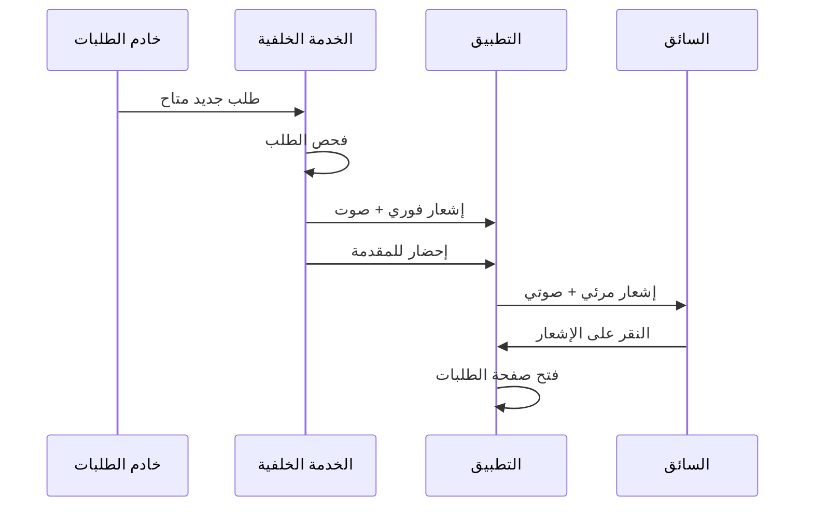
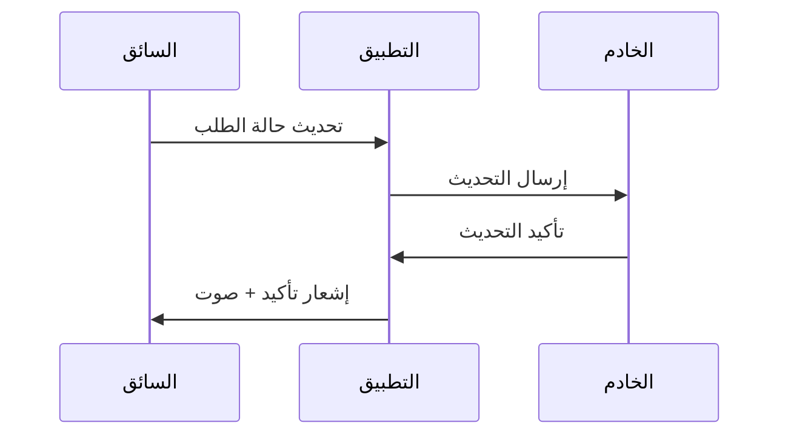
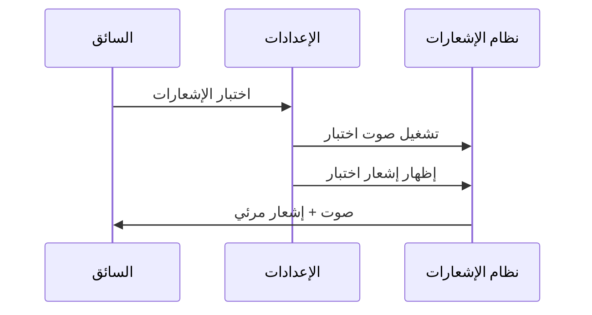

# دليل الإشعارات المنبثقة - تطبيق سائق كابتن طيار

## 📋 فهرس المحتويات
1. [نظرة عامة](#نظرة-عامة)
2. [أنواع الإشعارات](#أنواع-الإشعارات)
3. [Android - الأندرويد](#android---الأندرويد)
4. [iOS - الآيفون](#ios---الآيفون)
5. [Web - المتصفح](#web---المتصفح)
6. [React Hooks](#react-hooks)
7. [إعدادات المستخدم](#إعدادات-المستخدم)
8. [استكشاف الأخطاء](#استكشاف-الأخطاء)

---

## نظرة عامة

تطبيق سائق كابتن طيار يستخدم نظام إشعارات متقدم ومتعدد الطبقات لضمان وصول إشعارات الطلبات الجديدة للسائق في جميع الأوقات، حتى لو كان التطبيق في الخلفية أو مغلق.

### الهدف الرئيسي
- **ضمان وصول الإشعارات**: حتى لو كان التطبيق مغلق أو في الخلفية
- **تجربة مستخدم ممتازة**: إشعارات واضحة مع أصوات مخصصة
- **توافق متعدد المنصات**: يعمل على Android و iOS والمتصفحات
- **تحكم كامل**: السائق يتحكم في جميع إعدادات الإشعارات

---

## أنواع الإشعارات

### 1. إشعارات الطلبات الجديدة 🆕
- **الغرض**: تنبيه السائق عند وصول طلب جديد
- **الأولوية**: عالية جداً (PRIORITY_MAX)
- **الصوت**: صوت مخصص أو افتراضي قوي
- **الاهتزاز**: نمط قوي ومتكرر
- **العرض**: فوق جميع التطبيقات (إذا مُفعّل)

### 2. إشعارات تحديث الحالة 📊
- **الغرض**: تأكيد تحديث حالة الطلب (استلام/توصيل)
- **الأولوية**: متوسطة
- **الصوت**: صوت تأكيد قصير
- **العرض**: إشعار عادي

### 3. إشعارات النظام 🔧
- **الغرض**: تحديثات التطبيق والخدمة الخلفية
- **الأولوية**: منخفضة
- **الصوت**: بدون صوت أو صوت خفيف
- **العرض**: في شريط الإشعارات فقط

### 4. إشعارات الاختبار 🧪
- **الغرض**: اختبار عمل النظام
- **الأولوية**: متوسطة
- **الصوت**: حسب الإعدادات
- **العرض**: حسب الإعدادات

---

## Android - الأندرويد

### 1. الخدمة الخلفية (BackgroundOrderService.java)

**الموقع:** `android/app/src/main/java/com/tayardriver/app/BackgroundOrderService.java`

```java
public class BackgroundOrderService extends Service {
    private static final String ORDER_CHANNEL_ID = "ORDER_NOTIFICATIONS";
    private static final int ORDER_NOTIFICATION_ID = 2001;
    
    // إنشاء قناة إشعارات الطلبات مع أولوية عالية
    private void createNotificationChannels() {
        if (Build.VERSION.SDK_INT >= Build.VERSION_CODES.O) {
            NotificationChannel orderChannel = new NotificationChannel(
                    ORDER_CHANNEL_ID,
                    "إشعارات الطلبات",
                    NotificationManager.IMPORTANCE_HIGH
            );
            orderChannel.setDescription("إشعارات الطلبات الجديدة");
            orderChannel.enableLights(true);
            orderChannel.setLightColor(Color.RED);
            orderChannel.enableVibration(true);
            orderChannel.setVibrationPattern(new long[]{0, 500, 200, 500, 200, 500});
            orderChannel.setShowBadge(true);
            orderChannel.setLockscreenVisibility(Notification.VISIBILITY_PUBLIC);
            orderChannel.setBypassDnd(true); // تجاوز وضع عدم الإزعاج
            
            NotificationManager manager = getSystemService(NotificationManager.class);
            if (manager != null) {
                manager.createNotificationChannel(orderChannel);
            }
        }
    }
    
    // إظهار إشعار طلب جديد مع إحضار التطبيق للمقدمة
    public void showOrderNotification(String title, String content) {
        Intent intent = new Intent(this, MainActivity.class);
        intent.setFlags(Intent.FLAG_ACTIVITY_NEW_TASK | Intent.FLAG_ACTIVITY_CLEAR_TOP | Intent.FLAG_ACTIVITY_SINGLE_TOP);
        intent.putExtra("openOrders", true);
        intent.putExtra("newOrderAlert", true);
        intent.putExtra("autoOpenOrders", true);
        intent.putExtra("forceToFront", true);
        
        PendingIntent pendingIntent = PendingIntent.getActivity(this, 
            (int) System.currentTimeMillis(), intent, 
            PendingIntent.FLAG_UPDATE_CURRENT | PendingIntent.FLAG_IMMUTABLE);
        
        // إنشاء إشعار قوي مع أولوية عالية
        Notification orderNotification = new NotificationCompat.Builder(this, ORDER_CHANNEL_ID)
                .setContentTitle(title)
                .setContentText(content)
                .setSmallIcon(R.mipmap.ic_launcher)
                .setContentIntent(pendingIntent)
                .setAutoCancel(true)
                .setPriority(NotificationCompat.PRIORITY_MAX) // أولوية قصوى
                .setCategory(NotificationCompat.CATEGORY_CALL)
                .setDefaults(NotificationCompat.DEFAULT_ALL)
                .setVisibility(NotificationCompat.VISIBILITY_PUBLIC)
                .setFullScreenIntent(pendingIntent, true) // إظهار في الشاشة الكاملة
                .setOngoing(false)
                .setTimeoutAfter(60000) // إخفاء بعد دقيقة
                .setVibrate(new long[]{0, 500, 200, 500, 200, 500})
                .setLights(Color.RED, 1000, 1000)
                .build();
        
        if (notificationManager != null) {
            notificationManager.notify(ORDER_NOTIFICATION_ID + (int) System.currentTimeMillis(), orderNotification);
        }
        
        // محاولة إحضار التطبيق للمقدمة
        try {
            startActivity(intent);
        } catch (Exception e) {
            android.util.Log.e("BackgroundService", "فشل في إحضار التطبيق للمقدمة: " + e.getMessage());
        }
    }
}
```

### 2. النشاط الرئيسي (MainActivity.java)

**الموقع:** `android/app/src/main/java/com/tayardriver/app/MainActivity.java`

```java
public class MainActivity extends BridgeActivity {
    
    @Override
    protected void onNewIntent(Intent intent) {
        super.onNewIntent(intent);
        setIntent(intent);
        handleNewOrderIntent(intent);
    }
    
    private void handleNewOrderIntent(Intent intent) {
        if (intent != null) {
            boolean openOrders = intent.getBooleanExtra("openOrders", false);
            boolean newOrderAlert = intent.getBooleanExtra("newOrderAlert", false);
            boolean autoOpenOrders = intent.getBooleanExtra("autoOpenOrders", false);
            boolean forceToFront = intent.getBooleanExtra("forceToFront", false);
            
            if (openOrders || newOrderAlert || autoOpenOrders || forceToFront) {
                // إحضار النشاط للمقدمة
                getWindow().addFlags(android.view.WindowManager.LayoutParams.FLAG_SHOW_WHEN_LOCKED);
                getWindow().addFlags(android.view.WindowManager.LayoutParams.FLAG_TURN_SCREEN_ON);
                getWindow().addFlags(android.view.WindowManager.LayoutParams.FLAG_KEEP_SCREEN_ON);
                
                // إرسال أحداث JavaScript لفتح صفحة الطلبات
                getBridge().getWebView().evaluateJavascript(
                    "window.focus(); window.dispatchEvent(new CustomEvent('open-orders-page'));", 
                    null
                );
                
                // محاولة ثانية بعد تأخير
                new Handler(Looper.getMainLooper()).postDelayed(() -> {
                    getBridge().getWebView().evaluateJavascript(
                        "if (window.location.pathname !== '/orders') { window.location.href = '/orders'; }", 
                        null
                    );
                }, 500);
            }
        }
    }
}
```

### 3. الأذونات المطلوبة (AndroidManifest.xml)

```xml
<!-- أذونات الإشعارات والعرض فوق التطبيقات -->
<uses-permission android:name="android.permission.SYSTEM_ALERT_WINDOW" />
<uses-permission android:name="android.permission.POST_NOTIFICATIONS" />
<uses-permission android:name="android.permission.VIBRATE" />
<uses-permission android:name="android.permission.WAKE_LOCK" />
<uses-permission android:name="android.permission.DISABLE_KEYGUARD" />
<uses-permission android:name="android.permission.TURN_SCREEN_ON" />
<uses-permission android:name="android.permission.REQUEST_IGNORE_BATTERY_OPTIMIZATIONS" />
```

---

## iOS - الآيفون

### 1. مدير التطبيق (AppDelegate.swift)

**الموقع:** `ios/App/App/AppDelegate.swift`

```swift
import UserNotifications

class AppDelegate: UIResponder, UIApplicationDelegate, UNUserNotificationCenterDelegate {
    
    func application(_ application: UIApplication, didFinishLaunchingWithOptions launchOptions: [UIApplication.LaunchOptionsKey: Any]?) -> Bool {
        
        // تسجيل للإشعارات
        UNUserNotificationCenter.current().delegate = self
        
        // طلب أذونات الإشعارات
        let center = UNUserNotificationCenter.current()
        center.requestAuthorization(options: [.alert, .sound, .badge, .criticalAlert]) { granted, error in
            if granted {
                print("تم منح إذن الإشعارات")
                DispatchQueue.main.async {
                    application.registerForRemoteNotifications()
                }
            }
        }
        
        return true
    }
    
    // التعامل مع الإشعارات عند ظهورها
    func userNotificationCenter(_ center: UNUserNotificationCenter, willPresent notification: UNNotification, withCompletionHandler completionHandler: @escaping (UNNotificationPresentationOptions) -> Void) {
        // إظهار الإشعار حتى لو كان التطبيق في المقدمة
        completionHandler([.alert, .sound, .badge])
    }
    
    // التعامل مع النقر على الإشعارات
    func userNotificationCenter(_ center: UNUserNotificationCenter, didReceive response: UNNotificationResponse, withCompletionHandler completionHandler: @escaping () -> Void) {
        let userInfo = response.notification.request.content.userInfo
        
        // إذا كان إشعار طلب، فتح صفحة الطلبات
        if let isOrder = userInfo["isOrder"] as? Bool, isOrder {
            NotificationCenter.default.post(
                name: Notification.Name("OPEN_ORDERS_PAGE"), 
                object: nil
            )
        }
        
        completionHandler()
    }
}
```

### 2. خدمة الإشعارات (NotificationService.swift)

**الموقع:** `ios/App/App/NotificationService.swift`

```swift
import UserNotifications

class NotificationService {
    static let shared = NotificationService()
    
    func scheduleOrderNotification(title: String, body: String) {
        let content = UNMutableNotificationContent()
        content.title = title
        content.body = body
        content.sound = UNNotificationSound(named: UNNotificationSoundName("order.wav"))
        content.badge = 1
        content.categoryIdentifier = "ORDER_CATEGORY"
        content.userInfo = ["isOrder": true, "autoOpen": true]
        
        // إضافة أزرار التفاعل
        let acceptAction = UNNotificationAction(
            identifier: "ACCEPT_ACTION",
            title: "قبول الطلب",
            options: [.foreground]
        )
        
        let viewAction = UNNotificationAction(
            identifier: "VIEW_ACTION",
            title: "عرض التفاصيل",
            options: [.foreground]
        )
        
        let category = UNNotificationCategory(
            identifier: "ORDER_CATEGORY",
            actions: [acceptAction, viewAction],
            intentIdentifiers: [],
            options: [.customDismissAction]
        )
        
        UNUserNotificationCenter.current().setNotificationCategories([category])
        
        // إنشاء طلب الإشعار (فوري)
        let request = UNNotificationRequest(
            identifier: "order-\(UUID().uuidString)",
            content: content,
            trigger: nil // إظهار فوري
        )
        
        // إضافة الطلب لمركز الإشعارات
        UNUserNotificationCenter.current().add(request) { error in
            if let error = error {
                print("خطأ في جدولة إشعار الطلب: \(error)")
            }
        }
    }
}
```

### 3. إعدادات iOS (Info.plist)

```xml
<!-- أوضاع الخلفية -->
<key>UIBackgroundModes</key>
<array>
    <string>fetch</string>
    <string>location</string>
    <string>processing</string>
    <string>remote-notification</string>
</array>

<!-- أذونات الإشعارات -->
<key>NSUserNotificationAlertStyle</key>
<string>alert</string>

<!-- أذونات الإشعارات الحرجة -->
<key>UNAuthorizationOptionCriticalAlert</key>
<true/>
```

---

## Web - المتصفح

### 1. Service Worker

**الموقع:** `public/sw.js`

```javascript
// التعامل مع النقر على الإشعارات
self.addEventListener('notificationclick', (event) => {
  console.log('تم النقر على الإشعار:', event.notification);
  
  event.notification.close();
  
  // إذا كان الإشعار يحتوي على بيانات فتح تلقائي
  const notificationData = event.notification.data || {};
  const targetUrl = notificationData.url || '/orders';
  
  // التركيز على نافذة التطبيق أو فتح نافذة جديدة
  event.waitUntil(
    self.clients.matchAll({ type: 'window' }).then((clients) => {
      // البحث عن نافذة مفتوحة
      for (const client of clients) {
        if (client.url.includes(self.location.origin)) {
          client.focus();
          return client.navigate(targetUrl);
        }
      }
      
      // فتح نافذة جديدة إذا لم توجد نوافذ مفتوحة
      return self.clients.openWindow(targetUrl);
    })
  );
});

// التعامل مع رسائل Push
self.addEventListener('push', (event) => {
  if (event.data) {
    const data = event.data.json();
    
    const options = {
      body: data.body || 'طلب جديد متاح',
      icon: '/notification-icon.svg',
      badge: '/notification-icon.svg',
      tag: 'new-order',
      renotify: true,
      requireInteraction: true,
      vibrate: [300, 150, 300, 150, 300],
      data: {
        autoOpen: true,
        url: '/orders'
      },
      actions: [
        {
          action: 'view',
          title: 'عرض الطلب'
        },
        {
          action: 'dismiss',
          title: 'إغلاق'
        }
      ]
    };
    
    event.waitUntil(
      self.registration.showNotification(data.title || 'طلب جديد!', options)
    );
  }
});
```

### 2. إشعارات المتصفح المحسنة

```javascript
// إظهار إشعارات متعددة مع تأخيرات للتأكد من الوصول
const showWebNotification = (id, delay = 0) => {
  setTimeout(() => {
    const notification = new Notification(title, {
      body: content,
      icon: '/notification-icon.svg',
      tag: id,
      renotify: true,
      requireInteraction: true,
      vibrate: [500, 200, 500, 200, 500],
      silent: false,
      badge: '/notification-icon.svg',
      data: {
        autoOpen: true,
        url: '/orders',
        timestamp: Date.now(),
        forceOpen: true
      }
    });
    
    notification.onclick = () => {
      // إحضار النافذة للمقدمة
      window.focus();
      if (window.parent !== window) {
        window.parent.focus();
      }
      
      notification.close();
      if (window.location.pathname !== '/orders') {
        window.location.href = '/orders';
      }
    };
    
    // إغلاق تلقائي بعد 60 ثانية
    setTimeout(() => notification.close(), 60000);
  }, delay);
};

// إظهار إشعارات متعددة
showWebNotification('new-order-primary', 0);
showWebNotification('new-order-secondary', 2000);
showWebNotification('new-order-reminder', 5000);
```

---

## React Hooks

### 1. useNotifications Hook

**الموقع:** `src/hooks/useNotifications.ts`

```typescript
export function useNotifications() {
  const [hasPermission, setHasPermission] = useState<boolean>(false);
  const [volumeLevel, setVolumeLevel] = useState<VolumeLevel>('high');

  // إظهار إشعار مع خيارات متقدمة
  const showNotification = useCallback(async (
    title: string, 
    options: NotificationOptions = {},
    playNotificationSound = false
  ) => {
    try {
      if (Capacitor.isNativePlatform()) {
        // للمنصات الأصلية
        await LocalNotifications.schedule({
          notifications: [
            {
              title,
              body: options.body || '',
              id: Date.now(),
              sound: 'notification.wav',
              attachments: [],
              actionTypeId: 'ORDER',
              extra: { ...options, autoOpen: true }
            }
          ]
        });
      } else {
        // للمتصفحات
        if ('Notification' in window && Notification.permission === 'granted') {
          const notification = new Notification(title, {
            body: options.body,
            icon: options.icon || '/notification-icon.svg',
            tag: options.tag,
            renotify: options.renotify,
            requireInteraction: options.requireInteraction,
            silent: options.silent || false,
            vibrate: options.vibrate || [200, 100, 200],
            badge: '/notification-icon.svg',
            data: {
              autoOpen: true,
              url: '/orders'
            }
          });
          
          notification.onclick = () => {
            window.focus();
            notification.close();
            if (window.location.pathname !== '/orders') {
              window.location.href = '/orders';
            }
          };
        }
      }

      // تشغيل الصوت إذا طُلب
      if (playNotificationSound) {
        await playSound(false);
      }

      return true;
    } catch (error) {
      console.error('خطأ في إظهار الإشعار:', error);
      return false;
    }
  }, [hasPermission, playSound]);

  return {
    hasPermission,
    showNotification,
    testNotification,
    requestPermission
  };
}
```

### 2. useBackgroundService Hook

**الموقع:** `src/hooks/useBackgroundService.ts`

```typescript
export function useBackgroundService() {
  // دالة لإظهار إشعار الطلب
  const showOrderNotification = useCallback(async (title: string, content: string) => {
    try {
      console.log('إظهار إشعار الطلب:', { title, content });
      
      // تشغيل الصوت فوراً
      try {
        const urgentSound = new Howl({
          src: ['/order.wav', '/notification.wav'],
          volume: 1.0,
          preload: false,
          html5: true
        });
        urgentSound.play();
      } catch (soundError) {
        console.error('فشل في تشغيل الصوت:', soundError);
      }
      
      // إضافة اهتزاز قوي
      if (Capacitor.isNativePlatform()) {
        try {
          await Haptics.impact({ style: ImpactStyle.Heavy });
          setTimeout(() => Haptics.impact({ style: ImpactStyle.Heavy }), 500);
          setTimeout(() => Haptics.impact({ style: ImpactStyle.Heavy }), 1000);
        } catch (error) {
          console.warn('الاهتزاز غير متاح:', error);
        }
      }

      if (Capacitor.isNativePlatform()) {
        if (Capacitor.getPlatform() === 'android') {
          // استخدام خدمة Android الأصلية
          await BackgroundService.showOrderNotification({ title, content });
          
          // محاولة إحضار التطبيق للمقدمة
          try {
            await BackgroundService.bringAppToForeground();
          } catch (error) {
            console.warn('فشل في إحضار التطبيق للمقدمة:', error);
          }
        } else if (Capacitor.getPlatform() === 'ios') {
          // على iOS، استخدام الإشعارات المحلية
          await LocalNotifications.schedule({
            notifications: [
              {
                silent: false,
                title,
                body: content,
                id: Date.now(),
                sound: 'notification.wav',
                extra: {
                  isOrder: true,
                  autoOpen: true
                },
                actions: [
                  {
                    id: 'open_app',
                    title: 'فتح التطبيق',
                    requiresAuthentication: false,
                    foreground: true
                  }
                ]
              }
            ]
          });
        }
      } else {
        // للمتصفحات، إشعارات محسنة
        if ('Notification' in window && Notification.permission === 'granted') {
          // محاولة إحضار النافذة للمقدمة فوراً
          window.focus();
          
          // إظهار إشعارات متعددة
          showWebNotification('new-order-primary', 0);
          showWebNotification('new-order-secondary', 2000);
          showWebNotification('new-order-reminder', 5000);
        }
      }
    } catch (error) {
      console.error('فشل في إظهار إشعار الطلب:', error);
    }
  }, []);

  return { showOrderNotification };
}
```

### 3. useCustomSound Hook

**الموقع:** `src/hooks/useCustomSound.ts`

```typescript
export function useCustomSound() {
  const [customSoundSettings, setCustomSoundSettings] = useState<CustomSoundSettings>({
    hasCustomSound: false,
    soundName: '',
    soundUrl: '',
    volume: 1.0
  });

  // تشغيل الصوت المخصص
  const playCustomSound = useCallback(async () => {
    try {
      if (customSound && customSoundSettings.hasCustomSound) {
        // تفعيل Audio Context إذا لزم الأمر
        if (window.AudioContext || (window as any).webkitAudioContext) {
          try {
            const audioContext = new (window.AudioContext || (window as any).webkitAudioContext)();
            if (audioContext.state === 'suspended') {
              await audioContext.resume();
            }
          } catch (contextError) {
            console.warn('خطأ في Audio Context:', contextError);
          }
        }

        try {
          customSound.stop();
          customSound.play();
          console.log('تشغيل الصوت المخصص:', customSoundSettings.soundName);
          return true;
        } catch (playError) {
          console.error('خطأ في تشغيل الصوت المخصص:', playError);
          return false;
        }
      }
      return false;
    } catch (error) {
      console.error('خطأ في تشغيل الصوت المخصص:', error);
      return false;
    }
  }, [customSound, customSoundSettings]);

  return {
    customSoundSettings,
    playCustomSound,
    testCustomSound,
    uploadCustomSound,
    removeCustomSound
  };
}
```

---

## إعدادات المستخدم

### 1. التحكم في العرض فوق التطبيقات

**الموقع:** `src/pages/Settings.tsx`

```typescript
const [overlayPermissionEnabled, setOverlayPermissionEnabled] = useState(false);

// تحديث إعداد العرض فوق التطبيقات
const updateOverlayPermission = (enabled: boolean) => {
  setOverlayPermissionEnabled(enabled);
  localStorage.setItem('overlay_permission_enabled', enabled.toString());
  
  if (enabled) {
    toast.success('تم تفعيل العرض فوق التطبيقات الأخرى');
    toast('تنبيه: قد يمنع هذا الإعداد الوصول للتطبيقات الأخرى', {
      icon: '⚠️',
      duration: 5000
    });
  } else {
    toast.success('تم إلغاء تفعيل العرض فوق التطبيقات الأخرى');
  }
};

// فحص إذن النظام
const checkSystemOverlayPermission = async () => {
  // في التطبيق الحقيقي، ستفحص الإذن الفعلي من النظام
  const hasSystemPermission = overlayPermissionEnabled;
  
  if (hasSystemPermission) {
    toast.success('إذن العرض فوق التطبيقات مُفعّل في النظام');
  } else {
    toast.error('إذن العرض فوق التطبيقات غير مُفعّل في النظام');
  }
};
```

### 2. التحكم في مستوى الصوت

**الموقع:** `src/components/VolumeControl.tsx`

```typescript
const volumeConfig = {
  low: { 
    label: 'منخفض', 
    icon: Volume1, 
    color: 'text-gray-500',
    description: 'للبيئات الهادئة'
  },
  medium: { 
    label: 'متوسط', 
    icon: Volume2, 
    color: 'text-blue-500',
    description: 'للاستخدام العادي'
  },
  high: { 
    label: 'عالي', 
    icon: Volume2, 
    color: 'text-yellow-500',
    description: 'للبيئات الصاخبة'
  },
  max: { 
    label: 'أقصى', 
    icon: Volume2, 
    color: 'text-red-500',
    description: 'أعلى مستوى ممكن'
  }
};
```

### 3. رفع الأصوات المخصصة

**الموقع:** `src/components/CustomSoundUploader.tsx`

```typescript
const handleFileSelect = async (file: File) => {
  // التحقق من نوع الملف
  if (!file.type.startsWith('audio/')) {
    toast.error('يرجى اختيار ملف صوتي صحيح (MP3, WAV, OGG)');
    return;
  }

  // التحقق من حجم الملف (حد أقصى 5 ميجابايت)
  if (file.size > 5 * 1024 * 1024) {
    toast.error('حجم الملف كبير جداً. الحد الأقصى 5 ميجابايت');
    return;
  }

  // رفع الملف وإنشاء Howl instance
  const soundUrl = URL.createObjectURL(file);
  const sound = new Howl({
    src: [soundUrl],
    volume: customSoundSettings.volume,
    preload: true,
    onload: () => {
      // حفظ الإعدادات الجديدة
      const newSettings = {
        hasCustomSound: true,
        soundName: file.name,
        soundUrl: soundUrl,
        volume: customSoundSettings.volume
      };
      saveSettings(newSettings);
      toast.success(`تم رفع الصوت "${file.name}" بنجاح`);
    },
    onloaderror: () => {
      toast.error('فشل في تحميل الملف الصوتي');
      URL.revokeObjectURL(soundUrl);
    }
  });
};
```

---

## سيناريوهات الاستخدام

### 1. وصول طلب جديد



### 2. تحديث حالة الطلب



### 3. اختبار الإشعارات



---

## أنواع الإشعارات بالتفصيل

### 1. إشعار الطلب الجديد 🆕

**الخصائص:**
- **العنوان**: "طلب جديد!"
- **المحتوى**: "لديك طلب جديد في انتظار التوصيل"
- **الصوت**: `/order.wav` أو صوت مخصص
- **الاهتزاز**: `[500, 200, 500, 200, 500]`
- **الأولوية**: `PRIORITY_MAX`
- **العرض**: فوق التطبيقات (إذا مُفعّل)
- **الإجراءات**: فتح التطبيق، إغلاق

**الكود:**
```typescript
await showOrderNotification(
  'طلب جديد!',
  'لديك طلب جديد في انتظار التوصيل'
);
```

### 2. إشعار تحديث الحالة ✅

**الخصائص:**
- **العنوان**: "تم تحديث الطلب"
- **المحتوى**: "تم استلام الطلب" أو "تم توصيل الطلب"
- **الصوت**: `/notification.wav`
- **الاهتزاز**: `[200, 100, 200]`
- **الأولوية**: `PRIORITY_DEFAULT`
- **العرض**: إشعار عادي

**الكود:**
```typescript
await showNotification(
  'تم تحديث الطلب',
  { 
    body: 'تم استلام الطلب بنجاح',
    tag: 'status-update'
  }
);
```

### 3. إشعار الاختبار 🧪

**الخصائص:**
- **العنوان**: "اختبار الصوت"
- **المحتوى**: "مستوى الصوت: [المستوى]"
- **الصوت**: حسب الإعدادات
- **الاهتزاز**: حسب الإعدادات
- **الأولوية**: `PRIORITY_DEFAULT`

**الكود:**
```typescript
await testNotification();
```

---

## إعدادات التخصيص

### 1. مستويات الصوت

| المستوى | الوصف | النسبة | الاستخدام |
|---------|--------|--------|-----------|
| منخفض | للبيئات الهادئة | 30% | الاستخدام الليلي |
| متوسط | للاستخدام العادي | 60% | البيئات الهادئة |
| عالي | للبيئات الصاخبة | 90% | الاستخدام العادي |
| أقصى | أعلى مستوى ممكن | 120% | البيئات الصاخبة جداً |

### 2. أنواع الأصوات المدعومة

- **MP3**: الأفضل والأكثر توافقاً
- **WAV**: جودة عالية
- **OGG**: بديل مفتوح المصدر
- **M4A**: لأجهزة Apple
- **AAC**: ضغط متقدم

### 3. إعدادات العرض فوق التطبيقات

**متى يُستخدم:**
- ✅ عند انتظار طلبات مهمة
- ✅ في أوقات الذروة
- ✅ عند العمل في بيئة صاخبة

**متى يُلغى:**
- ❌ عند عدم العمل
- ❌ عند استخدام تطبيقات أخرى مهمة
- ❌ عند مواجهة مشاكل في الوصول للتطبيقات

---

## استكشاف الأخطاء

### 1. الإشعارات لا تظهر

**الأسباب المحتملة:**
- إذن الإشعارات غير مُفعّل
- التطبيق في وضع عدم الإزعاج
- إعدادات النظام تمنع الإشعارات

**الحلول:**
```typescript
// فحص الأذونات
const { hasPermission } = useNotifications();
if (!hasPermission) {
  await requestPermission();
}

// اختبار الإشعارات
await testNotification();
```

### 2. الصوت لا يعمل

**الأسباب المحتملة:**
- مستوى الصوت منخفض
- الجهاز في الوضع الصامت
- ملف الصوت تالف

**الحلول:**
```typescript
// فحص مستوى الصوت
const { volumeLevel } = useNotifications();
console.log('مستوى الصوت الحالي:', volumeLevel);

// اختبار الصوت
await testCustomSound();
```

### 3. العرض فوق التطبيقات لا يعمل

**الأسباب المحتملة:**
- الإذن غير مُفعّل في النظام
- إصدار Android قديم
- قيود الأمان

**الحلول:**
```typescript
// فحص الإذن
const overlayEnabled = localStorage.getItem('overlay_permission_enabled') === 'true';

// طلب الإذن من النظام (Android)
if (Capacitor.getPlatform() === 'android') {
  // سيتم توجيه المستخدم لإعدادات النظام
}
```

---

## أفضل الممارسات

### 1. للمطورين

- **اختبر على أجهزة حقيقية**: المحاكيات قد لا تدعم جميع الميزات
- **استخدم أصوات قصيرة**: 3-10 ثوانٍ للحصول على أفضل تجربة
- **اختبر في جميع الحالات**: التطبيق مفتوح، مُصغر، مغلق
- **راقب استهلاك البطارية**: الخدمات الخلفية تستهلك البطارية

### 2. للمستخدمين (السائقين)

- **فعّل جميع الأذونات**: الموقع والإشعارات
- **استخدم أصوات واضحة**: اختر أصوات مميزة وواضحة
- **اضبط مستوى الصوت**: حسب البيئة المحيطة
- **فعّل العرض فوق التطبيقات**: فقط عند الحاجة
- **اختبر الإعدادات**: بانتظام للتأكد من عملها

### 3. لإدارة النظام

- **راقب معدل التسليم**: تأكد من وصول الإشعارات
- **اجمع التغذية الراجعة**: من السائقين حول جودة الإشعارات
- **حدّث الأصوات**: بانتظام لتجنب التعود
- **وفر دعم فني**: لمساعدة السائقين في الإعدادات

---

## الاختبار والتشخيص

### 1. اختبار شامل للإشعارات

```typescript
const testAllNotifications = async () => {
  try {
    // اختبار 1: الصوت المخصص
    await testCustomSound();
    
    // اختبار 2: إشعار الخدمة الخلفية
    await showOrderNotification(
      'اختبار طلب جديد!',
      'هذا اختبار لإشعارات الطلبات الجديدة'
    );
    
    // اختبار 3: الإشعار العادي
    await showNotification(
      'اختبار الإشعار العادي',
      {
        body: 'هذا اختبار للإشعارات العادية',
        tag: 'test-notification'
      }
    );
    
    // اختبار 4: اختبار النظام
    await testNotification();
    
    toast.success('تم إرسال جميع أنواع الإشعارات للاختبار!');
  } catch (error) {
    console.error('خطأ في اختبار الإشعارات:', error);
    toast.error('فشل في اختبار الإشعارات');
  }
};
```

### 2. معلومات التشخيص

```typescript
// معلومات النظام
const diagnosticInfo = {
  platform: Capacitor.getPlatform(),
  isNative: Capacitor.isNativePlatform(),
  hasNotificationPermission: hasPermission,
  hasLocationPermission: hasLocationPermission,
  volumeLevel: volumeLevel,
  overlayEnabled: overlayPermissionEnabled,
  customSoundEnabled: customSoundSettings.hasCustomSound,
  isOnline: navigator.onLine
};

console.log('معلومات التشخيص:', diagnosticInfo);
```

---

## الملفات الصوتية

### 1. الأصوات الافتراضية

- **`/notification.wav`**: صوت الإشعارات العادية
- **`/order.wav`**: صوت إشعارات الطلبات الجديدة

### 2. الأصوات المخصصة

- **التخزين**: في `localStorage` كـ Object URL
- **الصيغ المدعومة**: MP3, WAV, OGG, M4A, AAC
- **الحد الأقصى للحجم**: 5 ميجابايت
- **التحكم في الصوت**: 10% - 200%

---

## الأمان والخصوصية

### 1. الأذونات المطلوبة

- **الإشعارات**: لإظهار التنبيهات
- **الموقع**: لحساب المسافات
- **العرض فوق التطبيقات**: للإشعارات العاجلة (اختياري)
- **الاهتزاز**: للتنبيه الصوتي
- **الصوت**: لتشغيل الأصوات

### 2. حماية البيانات

- **لا يتم تخزين بيانات حساسة**: في الإشعارات
- **تشفير الاتصالات**: جميع الطلبات مشفرة
- **انتهاء صلاحية الإشعارات**: تُحذف تلقائياً بعد وقت محدد

---

## التحديثات المستقبلية

### 1. ميزات مخططة

- **إشعارات Push**: للعمل حتى لو كان التطبيق مغلق تماماً
- **إشعارات ذكية**: تتكيف مع سلوك السائق
- **تحليلات الإشعارات**: لتحسين معدل الاستجابة
- **إشعارات جماعية**: للطلبات المتعددة

### 2. تحسينات الأداء

- **تحسين استهلاك البطارية**: خوارزميات أكثر كفاءة
- **ضغط الأصوات**: لتوفير مساحة التخزين
- **ذاكرة تخزين ذكية**: للأصوات المستخدمة بكثرة

---

## خلاصة

نظام الإشعارات في تطبيق سائق كابتن طيار مصمم ليكون:

✅ **موثوق**: يضمن وصول الإشعارات في جميع الحالات  
🎵 **قابل للتخصيص**: أصوات ومستويات صوت مخصصة  
🔧 **قابل للتحكم**: تحكم كامل في جميع الإعدادات  
📱 **متوافق**: يعمل على جميع المنصات  
⚡ **سريع**: استجابة فورية للطلبات الجديدة  

هذا الدليل يغطي جميع جوانب نظام الإشعارات ويوفر المعلومات اللازمة للمطورين والمستخدمين على حد سواء! 📚🔔